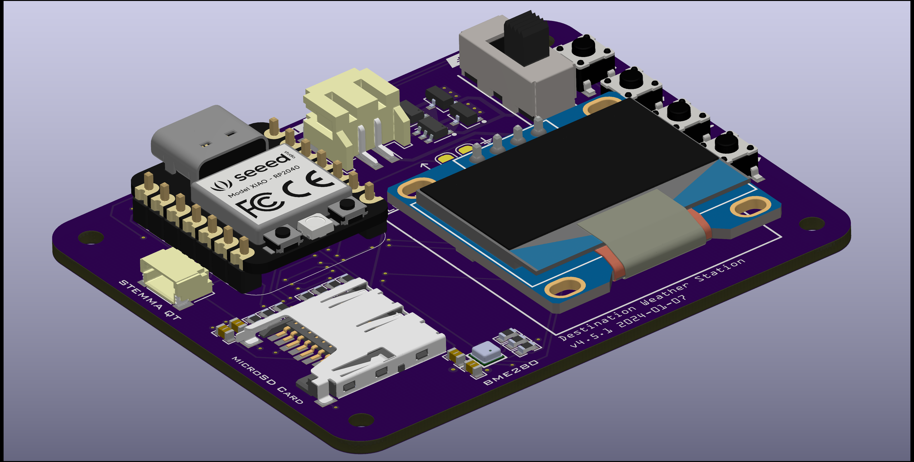

# Destination Weather Station v4.5 Documentation

## 🚀 Getting Started

### 📝 What's Included
- 1x Destination Weather Station v4.5
- 1x Seeeduino XIAO RP2040 microcontroller with headers
- 1x 128x64px OLED display with headers
- 1x SPDT slide switch
- 1x 4.5V AAA battery case
- 3x AAA batteries
- 1x USB A to USB C cable
- 1x 8GB microSD card
- 1x microSD to USB A adapter

### 🔧🔨 Soldering

#### Step 1:
- Take 2 1x7 male header pins and insert the long side of the pins into the board
- Carefully flip the board upside-down, without letting the headers fall out
- Place the tip of the soldering iron at the corner between the 1st pin and the gold pad, allowing it to heat up the board for 2-3 seconds
- Feed solder onto the pad with your other hand. The solder should melt and flow around the pad and pin.
- Remove the soldering iron after 2-3 more seconds
- Repeat with the 7th pin, then the other pins in the middle
- Repeat with the other 1x7 header

#### Step 2:
- Following the same steps above, solder the 1x4 header to the board

#### Step 3:
- Place the Seeeduino XIAO RP2040 on the 1x7 headers, with the USB C port and buttons facing up
- Following the same soldering techniques, solder all 14 pins on the XIAO

#### Step 4:
- Place the OLED display on the 1x4 header with the screen facing up
- Solder the first pin using the same technique used for the other pins
- Before soldering the other pins, hold the screen with one hand, and heat up the soldered pad
- Adjust the screen so it is flat with the weather station board
- Solder the 4th pin, then the 2 middle pins

#### Step 5:
- Insert the SPDT switch into the weather station board
- Carefully flip the board upside-down, without letting the button fall out
- Using the same technique as before, solder the 2 outside pins of the switch, then solder the 3 middle pins

### Final Assembly
- Insert the AAA batteries into the battery case
- Insert the microSD card into the weather station