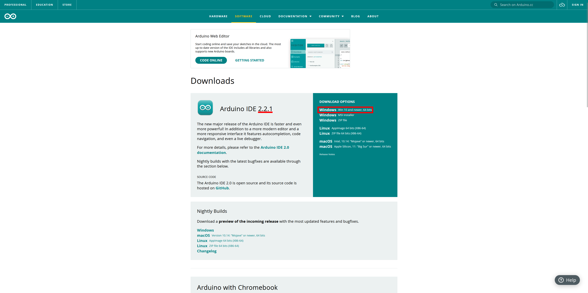
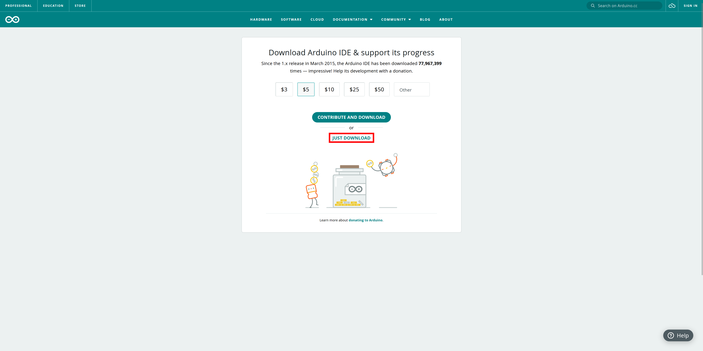
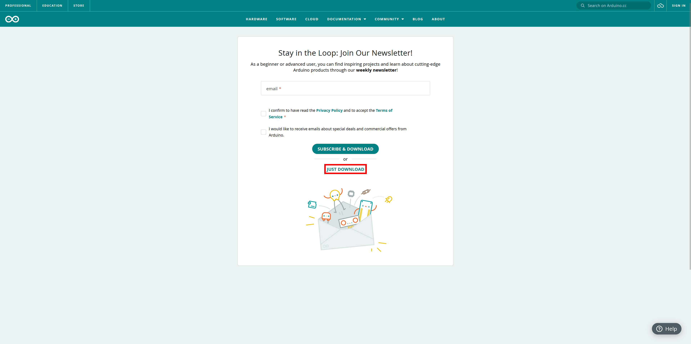
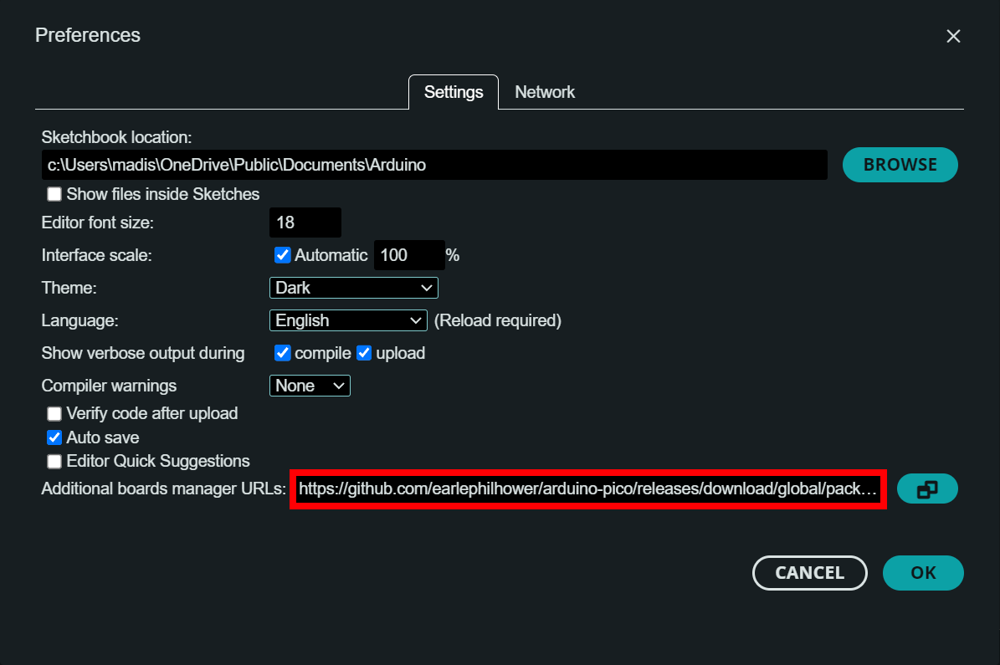
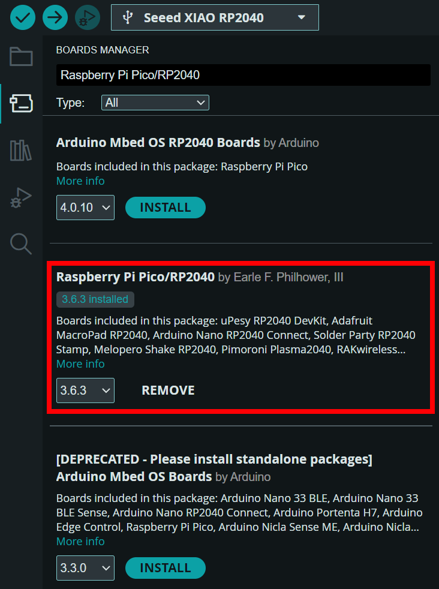

# Uploading Code
The following instructions are for how to install Arduino IDE and configure it for the Destination Weather Station v4.5.

## Directory
[//]: # (Directory Links)
<div>
<h3>
<ul>
    <li><a href="#💾-downloading-arduino-ide">💾 Downloading Arduino IDE</a></li>
    <details>
        <summary><a href="#💻-configuring-arduino-ide">💻 Configuring Arduino IDE</a></summary>
        <ul>
            <li><a href="#📥-installing-board-manager">📥 Installing Board Manager</a></li>
            <li><a href="#📥-installing-code-libraries">📥 Installing Code Libraries</a></li>
        </ul>
    </details>
    <li><a href="#👾-example-programs">👾 Example Programs</a></li>
</ul>
</h3>
</div>

## 💾 Downloading Arduino IDE
Go to https://www.arduino.cc/en/software/. To download the latest version of Arduino IDE, click ```Windows Win 10 and newer, 64 bits``` under ```DOWNLOAD OPTIONS```.



On the next page, click ```JUST DOWNLOAD```



On the next page, agian, click ```JUST DOWNLOAD```



## 💻 Configuring Arduino IDE
Before uploading code to the weather station, Arduino IDE must be configured first.

### 📥 Installing Board Manager
- Begin by opening Arduino IDE
- Click ```File > Preferences... (Ctrl+Comma)```
- In the ```Additional boards manager URLs``` textbox, enter the following URL: ```https://github.com/earlephilhower/arduino-pico/releases/download/global/package_rp2040_index.json``` and click ```OK```



- On the left vertical ribbon, click the second option. This will open the Boards Manager dialog box.
- In the search bar enter ```Raspberry Pi Pico/RP2040``` and click the result by **Earle F. Philhower, III** and click ```INSTALL```.



### 📥 Installing Code Libraries
Several code libraries are required to use the weather station. Download the following options by clicking the third option on the left vertical ribbon. Similarly to the Board Manager, you will enter the following library names into the search box, and click ```INSTALL```. When nessisary click, ```INSTALL ALL```

- ```Adafruit BME280 Library``` by Adafruit
- ```Adafruit LTR390 Library``` by Adafruit
- ```Adafruit SSD1306``` by Adafruit
- ```Adafruit VEML7700 Library``` by Adafruit
- ```ENS160 - Adafruit Fork``` by Adafruit
- ```SdFat - Adafruit Fork``` by Bill Greiman
- ```Sensirion I2C SCD4x``` by Sensirion

## 👾 Example Programs
The following example programs are provided for the weather station. Bellow is the title and description of them.

- [Blinky](../software/Blinky/Blinky.ino): Blinks the LEDs on the XIAO RP2040
- [I2C_Scanner](../software//I2C_Scanner/I2C_Scanner.ino): Checks to see what sensors are connected to the weather station
- [Sensor_Test](../software/Sensor_Test/Sensor_Test.ino): Tests all of the sensors connected to the weather station
- [Demo](../software/Demo/Demo.ino): Full demo of the weather station
- [Weather_Station](): Full version of the weather station code

<style>
    /* Adjust the margin or padding as needed */
    div {
        margin-left: -20px; /* or padding-left: 0; */

    }
    ul {
        margin-left: 20px; /* or padding-left: 0; */
        display: inline-block; /* Ensures the link and bullet are aligned */
    }

    details {
        margin-left: -15px; /* or padding-left: 0; */
        display: inline-block; /* Ensures the link and bullet are aligned */
    }
</style>